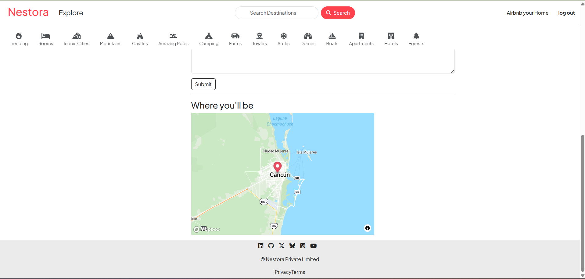

# 🌍 Nestora - Travel Destination Booking App

[](https://nodejs.org)
[](https://expressjs.com)
[](https://mongodb.com)
[](https://getbootstrap.com)

**Nestora** is a full-stack travel destination booking app where users can browse campgrounds, post reviews, upload images, and explore locations on an interactive map. It is built using **Node.js, Express, MongoDB**, and **EJS**, with features like image uploads via **Cloudinary** and location services via **Mapbox**.

---

## ✨ Features

- 🧑‍💻 User authentication (Register/Login)
- 🗺️ Map integration using Mapbox
- 📸 Upload multiple images via Cloudinary
- ✍️ Add and manage reviews with ratings
- 🔒 Authorization and error handling
- 🌐 Responsive UI with Bootstrap

---

## 🛠 Tech Stack

| Layer     | Technology                   |
| --------- | ---------------------------- |
| Frontend  | EJS, HTML, CSS, Bootstrap    |
| Backend   | Node.js, Express.js          |
| Database  | MongoDB Atlas                |
| Auth      | Passport.js, express-session |
| Image CDN | Cloudinary                   |
| Maps API  | Mapbox                       |

---

## 📦 Installation

### 1. Clone the repository

```bash
git clone https://github.com/Nischayb99/Nestora.git
cd nestora
```

### 2. Install dependencies

```bash
npm install
```

### 3. Create .env file

```bash
ATLASDB_URL=your_mongodb_atlas_url
SECRET=your_session_secret

CLOUD_NAME=your_cloudinary_cloud_name
CLOUD_API_KEY=your_cloudinary_api_key
CLOUD_API_SECRET=your_cloudinary_api_secret

MAP_TOKEN=your_mapbox_token
```

### 4. Run the app
```bash
Node app.js
```
Open your browser and go to:
http://localhost:8080


## 📸 Screenshots

### 🏠 Home Page


### 🏕️ Campground Detail Page


### 📝 Review Section


### 📝 Map Section



## 🙋‍♂️ Author

### Nischay Bandodiya
### 📧 Email: nischaywebdev@outlook.com
### 🌐 Website: https://nischay-bandodiya.onrender.com


## 📄 License

This project is open-source and available under the MIT License.  
See the [LICENSE](./LICENSE.txt) file for more information.
